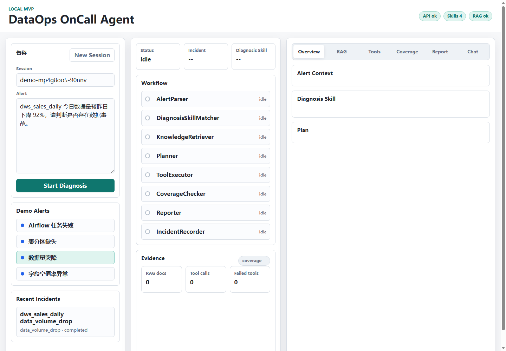
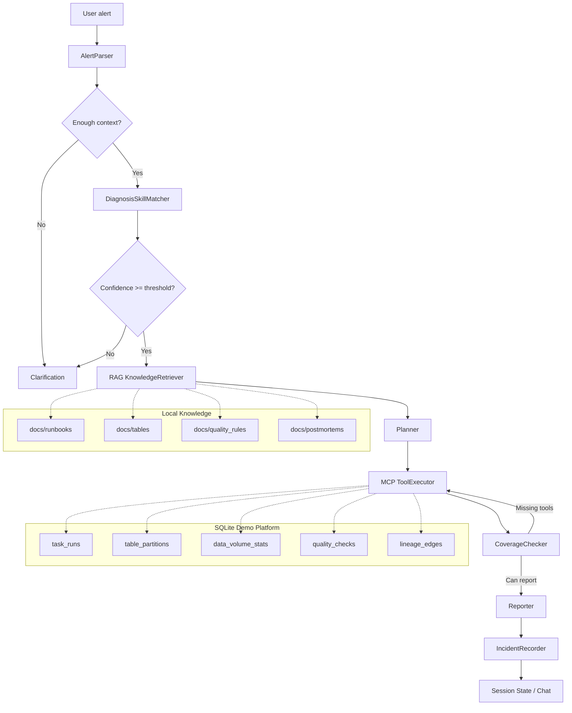

# DataOps OnCall Agent

DataOps OnCall Agent is a local, reproducible single-agent workflow MVP for DataOps incident diagnosis interviews. It turns a natural-language data alert into a traceable diagnosis flow: parse the alert, match a Diagnosis Skill, retrieve Runbook knowledge, call tools for evidence, check coverage, and generate an incident report.

The project is intentionally scoped as an interview-ready prototype, not a production data platform. It uses SQLite to simulate DataOps metadata and incident scenarios. The workflow is designed so the provider layer can later be replaced by Airflow API, Hive Metastore, DataHub, or a data quality platform.

## What It Demonstrates

- 4 MVP diagnosis scenarios: `airflow_task_failed`, `partition_missing`, `data_volume_drop`, `null_rate_spike`
- Diagnosis Skill Center for configurable diagnosis strategies
- Lightweight RAG over Runbooks, table docs, quality rules, and postmortems
- Local MCP-style tool layer over SQLite demo data
- LangGraph workflow with branching, retry, and state flow
- Optional DeepSeek decision layer for alert parsing, Skill routing, planning, and report summarization
- Optional Alibaba Cloud DashScope `text-embedding-v4` embeddings for hybrid RAG retrieval
- CoverageChecker to avoid premature root-cause conclusions
- FastAPI backend and local demo UI
- Session State for follow-up questions such as "它影响哪些下游报表？"
- Tests and eval datasets for Skill accuracy, RAG hit rate, and tool coverage

## Demo UI



## Architecture



## Key Concept Boundaries

| Component | Role |
| --- | --- |
| Diagnosis Skill | Diagnosis strategy for one incident type. Defines triggers, required tools, evidence requirements, risk level, and report expectations. |
| RAG | Retrieves Runbooks, table docs, quality rules, and postmortems as diagnosis references. |
| MCP Tool | Executes concrete read/write actions such as querying task runs, partitions, row counts, null rates, and lineage. |
| LangGraph | Orchestrates the diagnosis workflow and branching state. |
| SQLite | Simulates a reproducible DataOps metadata platform for local demos. |
| CoverageChecker | Checks whether required tools and evidence are complete before final reporting. |
| Session State | Preserves incident context for multi-turn follow-up questions. |

## Single-Agent Workflow, Not Multi-Agent

This MVP is not a multi-agent system. It is a single diagnosis agent implemented as a LangGraph workflow with multiple observable nodes.

The current design has one shared `DiagnosisState` flowing through:

```text
AlertParser -> DiagnosisSkillMatcher -> KnowledgeRetriever -> Planner -> ToolExecutor -> CoverageChecker -> Reporter -> IncidentRecorder
```

DeepSeek can participate in decision points, but the system does not create multiple independent agents with separate goals, memories, tool sets, or agent-to-agent communication.

Future multi-agent evolution could split the workflow into a Triage Agent, Evidence Agent, Knowledge Agent, Reporter Agent, and Reviewer Agent. This MVP intentionally keeps the workflow single-agent so tool coverage, evidence constraints, and tests stay easier to reason about.

## Quick Start

Requirements:

- Python 3.11+
- `uv`
- Windows PowerShell, CMD, or any shell that can run the commands below

Install dependencies:

```bash
uv sync
```

Reset demo data and build the local RAG index:

```bash
uv run python scripts/reset_demo_data.py
uv run python scripts/seed_demo_data.py
uv run python scripts/build_rag_index.py
```

Start the FastAPI service and demo UI:

```bash
uv run uvicorn app.main:app --host 0.0.0.0 --port 9900
```

Open:

```text
http://localhost:9900
```

Health check:

```bash
curl http://localhost:9900/api/health
```

Expected shape:

```json
{
  "code": 200,
  "message": "success",
  "data": {
    "status": "ok",
    "version": "0.1.0",
    "database": "ok",
    "mcp_server": "ok",
    "rag_index": "ok",
    "skills_loaded": 4
  }
}
```

If `uv` has a Windows cache permission issue, use the project-local cache:

```bash
uv --cache-dir .uv-cache run pytest tests -q
```

## Optional Real Model Providers

The default project is fully local: rule-based Skill matching, keyword/metadata RAG, SQLite tools, and deterministic report templates. Real model APIs are optional.

DeepSeek text model:

```powershell
$env:LLM_PROVIDER="deepseek"
$env:DEEPSEEK_API_KEY="your_deepseek_key"
$env:DEEPSEEK_BASE_URL="https://api.deepseek.com"
$env:DEEPSEEK_MODEL="deepseek-v4-flash"
```

When enabled, DeepSeek participates in workflow decisions:

- `AlertParser`: extracts or repairs alert context such as table, task, field, date, symptoms, and change ratio
- `DiagnosisSkillMatcher`: selects or rejects a Diagnosis Skill from the built-in Skill list
- `Planner`: proposes tool order, purpose, and arguments, then the code validates them against allowed tools
- `Reporter`: appends an auxiliary summary after the evidence-bound deterministic report

The model is not allowed to bypass tool execution or CoverageChecker. Invalid model outputs are ignored and the deterministic fallback remains active.

Alibaba Cloud Model Studio / DashScope embedding:

```powershell
$env:EMBEDDING_PROVIDER="aliyun"
$env:DASHSCOPE_API_KEY="your_dashscope_key"
$env:DASHSCOPE_BASE_URL="https://dashscope.aliyuncs.com/compatible-mode/v1"
$env:DASHSCOPE_EMBEDDING_MODEL="text-embedding-v4"
$env:DASHSCOPE_EMBEDDING_DIMENSIONS="1024"
uv run python scripts/build_rag_index.py --embedding-provider aliyun
```

After rebuilding the index with embeddings, RAG retrieval uses hybrid scoring: local keyword/metadata score plus embedding cosine similarity. Without these environment variables, the project keeps using the local retriever.

## Demo Script

Recommended case:

```text
dws_sales_daily 今日数据量较昨日下降 92%，请判断是否存在数据事故。
```

Interview flow:

1. Open `http://localhost:9900`.
2. Select the "数据量突降" demo alert.
3. Click "Start Diagnosis".
4. Show matched Diagnosis Skill: `data_volume_drop`.
5. Show RAG references, especially `docs/runbooks/data_volume_drop.md`.
6. Show tool timeline: `query_data_volume`, `query_task_runs`, `query_table_partitions`, `query_lineage`.
7. Show CoverageChecker with complete tool coverage.
8. Show the final Markdown incident report.
9. Ask: `它影响哪些下游报表？`
10. Show that the answer uses Session State and `query_lineage` evidence.

A longer demo guide is available in [docs/demo-script.md](docs/demo-script.md).

## API Examples

Run a non-streaming diagnosis:

```bash
curl -X POST http://localhost:9900/api/diagnose ^
  -H "Content-Type: application/json" ^
  -d "{\"session_id\":\"demo-session\",\"alert\":\"dws_sales_daily 今日数据量较昨日下降 92%，请判断是否存在数据事故。\",\"options\":{\"debug\":true}}"
```

Match a Diagnosis Skill:

```bash
curl -X POST http://localhost:9900/api/skills/match ^
  -H "Content-Type: application/json" ^
  -d "{\"alert\":\"dws_sales_daily 今日数据量较昨日下降 92%。\",\"debug\":true}"
```

Ask a follow-up question after diagnosis:

```bash
curl -X POST http://localhost:9900/api/chat ^
  -H "Content-Type: application/json" ^
  -d "{\"session_id\":\"demo-session\",\"message\":\"它影响哪些下游报表？\"}"
```

## Tests And Eval

Run all tests:

```bash
uv run pytest tests -q
```

Current verified result:

```text
43 passed
```

Run eval datasets:

```bash
uv run python eval/run_eval.py --dataset skill_match_cases
uv run python eval/run_eval.py --dataset rag_cases
uv run python eval/run_eval.py --dataset tool_coverage_cases
```

Current verified metrics:

| Eval | Metric | Result | Target |
| --- | --- | ---: | ---: |
| Skill match | accuracy | 1.0 | >= 0.85 |
| RAG retrieval | hit rate | 1.0 | >= 0.80 |
| Tool coverage | coverage | 1.0 | >= 0.90 |

## Project Structure

```text
app/
  api/                  FastAPI routes, schemas, service adapters
  db/                   SQLite connection, schema, seed helper
  rag/                  Lightweight local RAG indexer and retriever
  skills/               Diagnosis Skill models, loader, matcher, built-ins
  tools/                DataOps tool provider abstraction and SQLite provider
  workflow/             LangGraph state, graph, and diagnosis nodes
docs/
  runbooks/             Diagnosis runbooks
  tables/               Table descriptions
  quality_rules/        Data quality rule docs
  postmortems/          Historical incident notes
eval/
  datasets/             JSONL eval cases
mcp_servers/            Local JSON CLI tool server
scripts/                DB reset/seed and RAG build scripts
static/                 Demo UI
tests/                  Unit, integration, workflow, API, UI, eval-adjacent tests
```

## Honest Limitations

- The project does not connect to real production Airflow, Hive, Spark, Flink, or DataHub systems.
- SQLite is used to simulate DataOps metadata and fixed failure scenarios.
- The default Diagnosis Skill matcher remains deterministic rule-based; when `LLM_PROVIDER=deepseek`, DeepSeek can assist routing but must choose from built-in Skills and is validated by code.
- The default RAG retriever is lightweight keyword/metadata retrieval; when `EMBEDDING_PROVIDER=aliyun`, the project uses hybrid keyword + embedding retrieval, but it is still not a production vector database.
- The UI is a local demo workbench, not an enterprise operations console.
- The provider boundary is designed for future real-system integration, but those integrations are not implemented in this MVP.

## Interview Summary

Use this sentence as the main thread:

```text
This project is not a generic chatbot or a multi-agent demo. It decomposes DataOps incident diagnosis into a traceable single-agent workflow: DeepSeek can assist key decisions, Diagnosis Skill constrains the strategy, RAG provides knowledge, MCP Tool collects evidence, LangGraph orchestrates state, CoverageChecker constrains conclusions, and Session State supports follow-up questions.
```

Resume version:

```text
DataOps OnCall Agent: Built a FastAPI + LangGraph single-agent diagnosis workflow for DataOps incidents, supporting task failure, missing partition, data volume drop, and null-rate spike scenarios. Integrated DeepSeek for controlled decision assistance, Alibaba Cloud DashScope embeddings for hybrid RAG, configurable Diagnosis Skills, MCP-style SQLite tools, evidence coverage checking, Session State follow-up, demo UI, and eval datasets.
```
