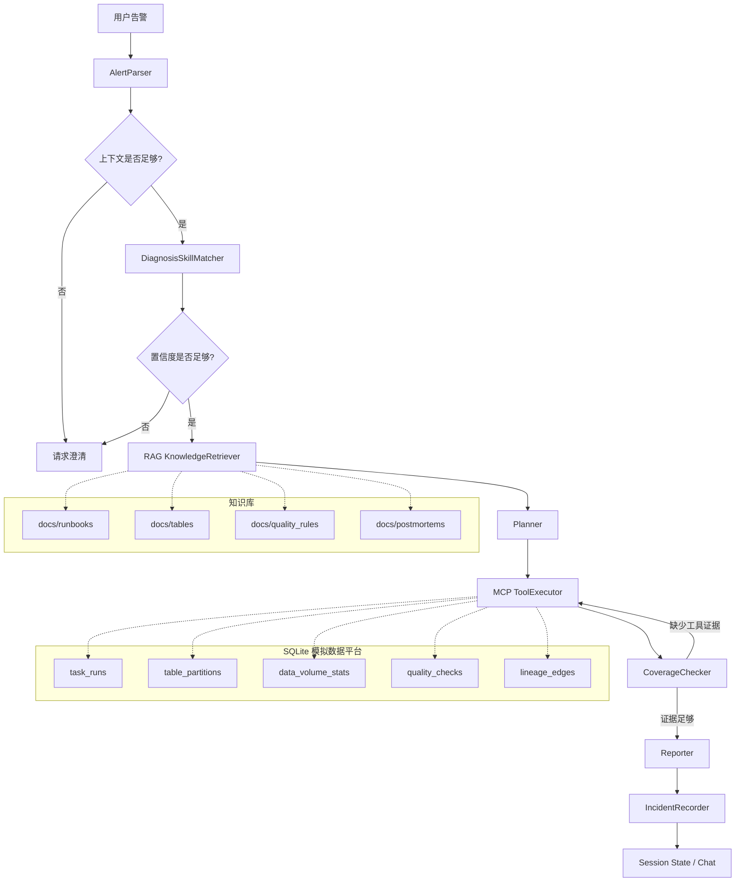

# DataOps OnCall Agent

面向求职面试的 DataOps 数据故障诊断 Agent MVP。

这个项目不是通用聊天机器人，也不是 Multi-Agent Demo。当前版本是一个 **single-agent workflow**：用 LangGraph 把一次 DataOps 排障拆成可观察、可测试、可解释的诊断流程。系统会解析自然语言告警，匹配 Diagnosis Skill，检索 Runbook，调用工具收集证据，检查证据覆盖率，最后生成带引用和工具证据的事故报告。

项目目标是快速支撑 AI 应用开发 / Agent 应用开发 / Python 后端相关岗位面试，而不是伪装成生产级数据平台。当前使用 SQLite 模拟数据平台元数据和故障场景，provider 边界保留，后续可以替换成 Airflow API、Hive Metastore、DataHub 或数据质量平台。

## 项目亮点

- 支持 4 个 MVP 故障场景：`airflow_task_failed`、`partition_missing`、`data_volume_drop`、`null_rate_spike`
- Diagnosis Skill Center：把不同故障类型抽象成可配置诊断策略
- DeepSeek 决策辅助：参与告警解析、Skill 路由、诊断规划和报告摘要
- RAG 知识检索：检索 Runbook、表说明、质量规则和历史事故复盘
- 阿里云百炼 `text-embedding-v4`：可选构建 hybrid RAG 检索
- MCP-style Tool 层：通过 SQLite provider 查询任务、分区、数据量、空值率和血缘
- LangGraph 工作流：支持分支、澄清、重试和状态流转
- CoverageChecker：避免工具没查全时过早输出确定根因
- Session State：支持多轮追问，例如“它影响哪些下游报表？”
- FastAPI + Demo UI：可本地运行和面试演示
- pytest + eval：验证 Skill 匹配、RAG 命中率和工具覆盖率

## Demo UI


## 架构



## 核心概念边界

| 组件 | 作用 |
| --- | --- |
| Diagnosis Skill | 某一类 DataOps 故障的诊断策略，定义触发条件、必需工具、证据要求、风险等级和报告约束 |
| RAG | 检索 Runbook、表说明、质量规则和历史事故复盘，作为诊断参考 |
| MCP Tool | 执行具体查询动作，例如查任务、分区、数据量、空值率和血缘 |
| LangGraph | 编排诊断节点和状态流转 |
| SQLite | 模拟可复现的数据平台元数据和故障场景 |
| CoverageChecker | 检查必需工具和核心证据是否齐全，限制过度确定结论 |
| Session State | 保存当前 incident、表、字段、Skill 和证据，支持多轮追问 |

## 不是 Multi-Agent

当前版本不是 Multi-Agent，而是一个 single-agent workflow。

它只有一个共享的 `DiagnosisState`，在以下节点之间流转：

```text
AlertParser -> DiagnosisSkillMatcher -> KnowledgeRetriever -> Planner -> ToolExecutor -> CoverageChecker -> Reporter -> IncidentRecorder
```

DeepSeek 会参与部分决策节点，但系统没有多个独立 Agent 实例，也没有 Agent-to-Agent 通信。这样设计是为了保证 MVP 阶段的工具证据链、CoverageChecker 和测试更可控。

后续如果扩展成 Multi-Agent，可以拆成：

```text
Triage Agent
Evidence Agent
Knowledge Agent
Reporter Agent
Reviewer Agent
```

## 快速开始

环境要求：

- Python 3.11+
- `uv`
- Windows PowerShell / CMD / Bash

安装依赖：

```bash
uv sync
```

重置并写入 demo 数据：

```bash
uv run python scripts/reset_demo_data.py
uv run python scripts/seed_demo_data.py
```

构建本地 RAG 索引：

```bash
uv run python scripts/build_rag_index.py
```

启动服务：

```bash
uv run uvicorn app.main:app --host 0.0.0.0 --port 9900
```

浏览器打开：

```text
http://localhost:9900
```

健康检查：

```bash
curl http://localhost:9900/api/health
```

期望返回：

```json
{
  "code": 200,
  "message": "success",
  "data": {
    "status": "ok",
    "version": "0.1.0",
    "database": "ok",
    "mcp_server": "ok",
    "rag_index": "ok",
    "skills_loaded": 4
  }
}
```

Windows 上如果遇到 uv 缓存或解释器权限问题，可以使用项目本地缓存：

```bash
uv --cache-dir .uv-cache run pytest tests -q
```

## 可选真实模型配置

默认情况下，项目可以完全本地运行：规则型 Skill 匹配、关键词/metadata RAG、SQLite 工具和确定性报告模板。

如果要启用真实模型，在本地 `.env` 中配置。注意：`.env` 不要提交到 GitHub。

DeepSeek 文本模型：

```env
LLM_PROVIDER=deepseek
DEEPSEEK_API_KEY=your_deepseek_key
DEEPSEEK_BASE_URL=https://api.deepseek.com
DEEPSEEK_MODEL=deepseek-v4-flash
```

启用后，DeepSeek 会参与：

- `AlertParser`：辅助解析表名、任务名、字段、日期、症状和变化比例
- `DiagnosisSkillMatcher`：在内置 Diagnosis Skill 中选择或要求澄清
- `Planner`：生成工具调用顺序、目的和参数，再由代码校验
- `Reporter`：在证据绑定报告后追加辅助摘要
- `/api/chat`：对泛化追问进行基于 Session State 的回答

阿里云百炼 Embedding：

```env
EMBEDDING_PROVIDER=aliyun
DASHSCOPE_API_KEY=your_dashscope_key
DASHSCOPE_BASE_URL=https://dashscope.aliyuncs.com/compatible-mode/v1
DASHSCOPE_EMBEDDING_MODEL=text-embedding-v4
DASHSCOPE_EMBEDDING_DIMENSIONS=1024
```

然后重建 RAG 索引：

```bash
uv run python scripts/build_rag_index.py --embedding-provider aliyun
```

启用后，RAG 使用 keyword/metadata score + embedding cosine similarity 的 hybrid 检索。

## 推荐演示案例

推荐输入：

```text
dws_sales_daily 今日数据量较昨日下降 92%，请判断是否存在数据事故。
```

演示顺序：

1. 打开 `http://localhost:9900`
2. 选择“数据量突降”demo alert
3. 点击开始诊断
4. 展示匹配到 `data_volume_drop`
5. 展示 RAG 引用，尤其是 `docs/runbooks/data_volume_drop.md`
6. 展示工具调用：`query_data_volume`、`query_task_runs`、`query_table_partitions`、`query_lineage`
7. 展示 CoverageChecker，确认工具和证据覆盖完整
8. 展示最终 Markdown 事故报告
9. 追问：`它影响哪些下游报表？`
10. 展示系统基于 Session State 和 `query_lineage` 证据回答

更完整的演示脚本见：[docs/demo-script.md](docs/demo-script.md)

## API 示例

非流式诊断：

```bash
curl -X POST http://localhost:9900/api/diagnose ^
  -H "Content-Type: application/json" ^
  -d "{\"session_id\":\"demo-session\",\"alert\":\"dws_sales_daily 今日数据量较昨日下降 92%，请判断是否存在数据事故。\",\"options\":{\"debug\":true}}"
```

匹配 Diagnosis Skill：

```bash
curl -X POST http://localhost:9900/api/skills/match ^
  -H "Content-Type: application/json" ^
  -d "{\"alert\":\"dws_sales_daily 今日数据量较昨日下降 92%。\",\"debug\":true}"
```

多轮追问：

```bash
curl -X POST http://localhost:9900/api/chat ^
  -H "Content-Type: application/json" ^
  -d "{\"session_id\":\"demo-session\",\"message\":\"它影响哪些下游报表？\"}"
```

## 测试和 Eval

运行全部测试：

```bash
uv run pytest tests -q
```

当前验证结果：

```text
45 passed
```

运行 eval：

```bash
uv run python eval/run_eval.py --dataset skill_match_cases
uv run python eval/run_eval.py --dataset rag_cases
uv run python eval/run_eval.py --dataset tool_coverage_cases
```

当前固定数据集指标：

| Eval | 指标 | 当前结果 | 目标 |
| --- | --- | ---: | ---: |
| Skill match | accuracy | 1.0 | >= 0.85 |
| RAG retrieval | hit rate | 1.0 | >= 0.80 |
| Tool coverage | coverage | 1.0 | >= 0.90 |

## 项目结构

```text
app/
  api/                  FastAPI routes, schemas, service adapters
  db/                   SQLite connection, schema, seed helper
  rag/                  RAG indexer and retriever
  skills/               Diagnosis Skill models, loader, matcher, built-ins
  tools/                DataOps tool provider abstraction and SQLite provider
  workflow/             LangGraph state, graph, and diagnosis nodes
docs/
  runbooks/             故障诊断 Runbook
  tables/               表说明
  quality_rules/        数据质量规则
  postmortems/          历史事故复盘
eval/
  datasets/             JSONL eval cases
mcp_servers/            本地 JSON CLI tool server
scripts/                DB reset/seed and RAG build scripts
static/                 Demo UI
tests/                  单元测试、集成测试、API 测试和 workflow smoke tests
```

## 诚实边界

- 当前没有接入真实生产 Airflow、Hive、Spark、Flink 或 DataHub。
- SQLite 用于模拟 DataOps 元数据和固定故障场景。
- DeepSeek 参与受约束的决策辅助，但不能绕过工具调用和 CoverageChecker。
- 阿里云 `text-embedding-v4` 用于 hybrid RAG，但当前不是生产级向量数据库方案。
- Demo UI 是本地面试演示工作台，不是企业级运维控制台。
- 真实系统迁移需要扩展 provider、权限、日志、监控和更大规模 eval 数据集。

## 面试主线

可以用这句话概括：

```text
这个项目不是普通 RAG Chatbot，也不是 Multi-Agent 包装项目，而是把 DataOps 故障诊断拆成可执行、可观察、可评估的 single-agent workflow。DeepSeek 参与关键决策，Diagnosis Skill 约束诊断策略，RAG 提供知识依据，MCP Tool 收集事实证据，LangGraph 编排状态流转，CoverageChecker 防止证据不足时过早下结论，Session State 支持多轮追问。
```

简历版本：

```text
DataOps OnCall Agent：基于 FastAPI、LangGraph、DeepSeek、RAG 和 MCP-style Tool 设计 DataOps 故障诊断 single-agent workflow，支持任务失败、分区缺失、数据量突降、字段空值率异常等场景；实现 Diagnosis Skill 匹配、Runbook 检索、SQLite 工具证据查询、CoverageChecker、多轮 Session State、Demo UI 和 eval 数据集。
```
