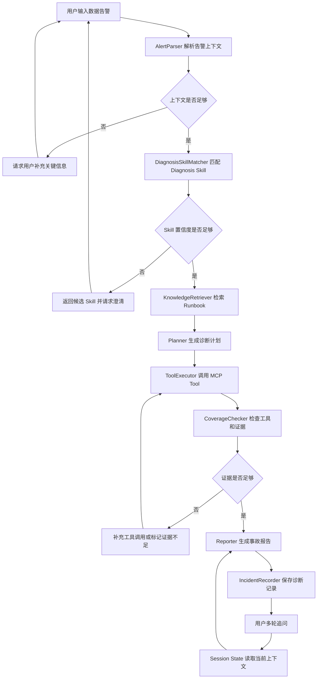

# 03 User Flow - DataOps OnCall Agent

版本：v0.1
日期：2026-05-14
关联文档：01-product-requirements.md、02-user-stories.md

## 1. 文档目标

本文档定义 DataOps OnCall Agent 的核心用户流程。目标是把用户从输入告警到获得事故报告的完整路径讲清楚，同时说明每一步对应的 Agent 节点、数据状态、RAG、MCP Tool 和 Diagnosis Skill 如何协作。

本项目的流程设计遵循一个原则：

> Agent 不应该直接从告警生成答案，而应该先选择诊断策略，再收集证据，最后生成可追溯报告。

## 2. 核心流程总览

```text
用户输入告警
  -> AlertParser 解析告警上下文
  -> DiagnosisSkillMatcher 匹配 Diagnosis Skill
  -> KnowledgeRetriever 检索 Runbook / 表说明 / 历史事故
  -> Planner 生成诊断计划
  -> ToolExecutor 调用 MCP Tool 查询证据
  -> CoverageChecker 检查工具和证据覆盖率
  -> Reporter 生成事故诊断报告
  -> IncidentRecorder 保存事故记录
  -> 用户多轮追问 / 查看报告 / 继续补充信息
```

对应 Mermaid 流程图：



## 3. 用户入口流程

### 3.1 入口页面

用户进入系统后，看到一个面向演示的诊断工作台。

页面区域：

- 告警输入区。
- 示例告警快捷按钮。
- Diagnosis Skill 匹配结果。
- 诊断计划。
- MCP Tool 调用过程。
- 证据列表。
- 最终事故报告。
- 历史诊断记录。

### 3.2 示例告警

系统提供 4 个演示案例按钮：

```text
1. Airflow 任务失败
2. 表分区缺失
3. 数据量突降
4. 字段空值率异常
```

点击后填入示例告警，方便面试时稳定演示。

### 3.3 用户输入格式

用户可以输入自然语言，不要求填写结构化表单。

示例：

```text
dws_sales_daily 今日数据量较昨日下降 92%，请判断是否存在数据事故。
```

系统需要从自然语言中解析：

- `table_name`: `dws_sales_daily`
- `metric`: 行数或数据量
- `date`: 今日
- `change_ratio`: 下降 92%
- `incident_type_candidate`: 数据量突降

## 4. AlertParser 流程

### 4.1 目标

AlertParser 负责把用户输入转成结构化上下文，为后续 Skill 匹配和工具调用提供基础字段。

### 4.2 输入

```json
{
  "session_id": "session-001",
  "raw_alert": "dws_sales_daily 今日数据量较昨日下降 92%，请判断是否存在数据事故。"
}
```

### 4.3 输出

```json
{
  "alert_context": {
    "table_name": "dws_sales_daily",
    "task_name": null,
    "field_name": null,
    "date": "2026-05-14",
    "time_range": "today_vs_yesterday",
    "symptoms": ["data_volume_drop"],
    "change_ratio": -0.92
  }
}
```

### 4.4 缺失信息处理

如果用户输入：

```text
今天销售报表不太对，帮我看看。
```

系统不能直接编造表名，而应该返回：

```text
我需要补充几个信息才能诊断：具体是哪张表或哪个指标？异常表现是数据量下降、分区缺失、任务失败，还是字段质量异常？
```

## 5. DiagnosisSkillMatcher 流程

### 5.1 目标

DiagnosisSkillMatcher 负责选择最合适的 Diagnosis Skill。它不是工具执行器，而是路由和策略选择模块。

### 5.2 匹配依据

匹配时综合使用：

- 用户告警中的关键词。
- AlertParser 提取的 `symptoms`。
- Skill metadata 中的 `triggers`。
- Skill examples 中的相似案例。
- 可选 LLM rerank。

### 5.3 输入

```json
{
  "alert_context": {
    "table_name": "dws_sales_daily",
    "symptoms": ["data_volume_drop"],
    "change_ratio": -0.92
  }
}
```

### 5.4 输出

```json
{
  "selected_diagnosis_skill": {
    "name": "data_volume_drop",
    "confidence": 0.91,
    "reason": "用户明确描述今日数据量较昨日下降 92%，符合数据量突降场景。"
  },
  "candidate_diagnosis_skills": [
    {
      "name": "data_volume_drop",
      "score": 0.91
    },
    {
      "name": "partition_missing",
      "score": 0.42
    }
  ]
}
```

### 5.5 低置信度流程

如果最高置信度低于阈值，例如 `0.65`，系统进入澄清流程。

```text
我无法确定这是分区缺失、数据量异常还是字段质量异常。请补充表名、异常指标或具体告警内容。
```

面试讲解点：

> 这里用来解决模型高置信度错误路由的问题。系统不把 LLM 的判断当绝对真理，而是通过候选 Skill、置信度和澄清机制降低误诊风险。

## 6. KnowledgeRetriever 流程

### 6.1 目标

KnowledgeRetriever 负责检索与当前 Diagnosis Skill 和告警上下文相关的知识资料。

检索对象包括：

- Skill 对应的 Runbook。
- 表口径说明。
- 数据质量规则说明。
- 历史事故复盘。
- 常见错误处理文档。

### 6.2 输入

```json
{
  "selected_diagnosis_skill": "data_volume_drop",
  "table_name": "dws_sales_daily",
  "symptoms": ["data_volume_drop"]
}
```

### 6.3 输出

```json
{
  "retrieved_docs": [
    {
      "source_file": "runbooks/data_volume_drop.md",
      "section_title": "数据量突降排查步骤",
      "chunk_id": "runbook-data-volume-drop-001",
      "score": 0.88,
      "content_summary": "先确认表分区是否产出，再检查上游任务和最近 7 天行数趋势。"
    },
    {
      "source_file": "tables/dws_sales_daily.md",
      "section_title": "表口径说明",
      "chunk_id": "table-dws-sales-daily-001",
      "score": 0.76,
      "content_summary": "dws_sales_daily 是每日销售汇总表，下游用于销售日报和收入看板。"
    }
  ]
}
```

### 6.4 检索不足处理

如果没有召回相关文档，系统仍可执行工具查询，但报告中必须说明：

```text
本次诊断未检索到足够相关的 Runbook 或历史事故资料，根因判断主要基于工具查询结果。
```

## 7. Planner 流程

### 7.1 目标

Planner 根据 Diagnosis Skill、Runbook 和上下文生成诊断计划。

### 7.2 计划生成原则

- 必须覆盖 Diagnosis Skill 的 `required_tools`。
- 必须满足 Skill 的 `evidence_requirements`。
- 优先执行只读查询工具。
- 不执行真实修复动作。
- 无证据不输出确定根因。

### 7.3 示例计划

针对 `data_volume_drop`：

```json
{
  "plan": [
    "查询 dws_sales_daily 最近 7 天数据量趋势",
    "查询 dws_sales_daily 今日分区是否存在",
    "查询 dws_sales_daily 相关任务今日运行状态",
    "查询 dws_sales_daily 上游依赖和下游影响范围",
    "结合 Runbook 和工具证据判断可能根因"
  ]
}
```

## 8. ToolExecutor 流程

### 8.1 目标

ToolExecutor 负责调用 MCP Tool 获取证据。

### 8.2 MCP Tool 列表

| Tool | 用途 | 数据源 |
|------|------|--------|
| `query_task_runs` | 查询任务运行状态 | SQLite `task_runs` |
| `query_table_partitions` | 查询表分区 | SQLite `table_partitions` |
| `query_data_volume` | 查询表每日行数 | SQLite `data_volume_stats` |
| `query_null_rate` | 查询字段空值率 | SQLite `quality_checks` |
| `query_lineage` | 查询上下游血缘 | SQLite `lineage_edges` |
| `create_incident_report` | 保存事故报告 | SQLite `incidents` |

### 8.3 工具调用记录

每次工具调用都写入 `tool_call_logs`。

字段包括：

- `session_id`
- `incident_id`
- `tool_name`
- `arguments`
- `status`
- `result_summary`
- `error_message`
- `created_at`

### 8.4 工具异常处理

如果工具失败，系统不应该吞掉错误。

示例：

```json
{
  "tool_name": "query_lineage",
  "status": "failed",
  "error_message": "lineage data not found for table dws_sales_daily"
}
```

报告中应展示：

```text
血缘查询失败，因此本次报告无法确认完整下游影响范围。
```

## 9. CoverageChecker 流程

### 9.1 目标

CoverageChecker 用于解决一个核心 Agent 问题：工具没查全时，模型可能提前给出看似确定但实际缺证据的结论。

### 9.2 输入

```yaml
selected_diagnosis_skill: data_volume_drop
required_tools:
  - query_data_volume
  - query_task_runs
  - query_table_partitions
  - query_lineage
evidence_requirements:
  - 最近 7 天行数趋势
  - 当前表分区状态
  - 相关任务运行状态
  - 下游影响范围
```

### 9.3 输出

```json
{
  "coverage_result": {
    "required_tools_coverage": 0.75,
    "missing_tools": ["query_lineage"],
    "evidence_coverage": 0.75,
    "missing_evidence": ["下游影响范围"],
    "can_generate_final_report": true,
    "confidence_limit": "medium"
  }
}
```

### 9.4 决策规则

- 覆盖率为 100%：可以生成完整报告。
- 覆盖率低于 100% 但核心证据存在：可以生成报告，但必须标记证据不足。
- 缺少关键证据：补充工具调用。
- 工具持续失败：生成降级报告，说明不可确认的部分。

面试讲解点：

> CoverageChecker 是项目深度点之一。它把 Diagnosis Skill 中的 required_tools 和 evidence_requirements 变成可检查约束，避免 Agent 随意下结论。

## 10. Reporter 流程

### 10.1 目标

Reporter 将诊断计划、工具证据、RAG 引用和 CoverageChecker 结果整理成 Markdown 事故报告。

### 10.2 报告结构

```markdown
# 数据事故诊断报告

## 1. 告警摘要

## 2. 匹配到的 Diagnosis Skill

## 3. 诊断步骤

## 4. 工具调用证据

## 5. 根因判断

## 6. 影响范围

## 7. 修复建议

## 8. 风险等级

## 9. 引用来源

## 10. 证据不足说明
```

### 10.3 报告生成规则

- 根因判断必须引用工具结果或 RAG 文档。
- 如果 CoverageChecker 显示证据不足，报告不能写成完全确定。
- 所有外部知识必须展示来源。
- 所有工具失败必须展示影响。

## 11. IncidentRecorder 流程

### 11.1 目标

IncidentRecorder 负责保存本次诊断结果，形成历史事故记录。

### 11.2 保存内容

- 原始告警。
- 解析后的上下文。
- 匹配到的 Diagnosis Skill。
- 工具调用记录。
- 证据摘要。
- 最终报告。
- 创建时间。

### 11.3 后续用途

- 支持用户查看历史诊断。
- 支持后续 RAG 检索历史事故。
- 支持面试演示“诊断结果沉淀”。

## 12. 多轮追问流程

### 12.1 用户追问示例

```text
用户：dws_sales_daily 今日数据量下降 92%，帮我诊断。
系统：已生成事故诊断报告。
用户：它影响哪些下游报表？
```

### 12.2 系统处理方式

系统从 Session State 中读取：

```json
{
  "session_id": "session-001",
  "incident_id": "incident-20260514-001",
  "current_table": "dws_sales_daily",
  "selected_diagnosis_skill": "data_volume_drop",
  "evidence": {
    "lineage": ["ads_sales_report", "ads_revenue_dashboard"]
  }
}
```

然后回答：

```text
根据当前 incident 的血缘查询结果，dws_sales_daily 影响 ads_sales_report 和 ads_revenue_dashboard。由于本次诊断已成功调用 query_lineage，影响范围证据较完整。
```

### 12.3 设计原则

- 多轮记忆依赖结构化 Session State。
- 聊天历史只作为辅助上下文。
- 用户使用“它”“这个表”“这个任务”时，优先解析为当前 incident 对象。

## 13. 四个 MVP 场景流程

### 13.1 Airflow 任务失败

```text
输入任务失败告警
  -> 解析 task_name
  -> 匹配 airflow_task_failed
  -> 检索任务失败 Runbook
  -> 查询 query_task_runs
  -> 查询 query_lineage
  -> 检查工具覆盖率
  -> 输出失败原因和下游影响
```

### 13.2 表分区缺失

```text
输入分区缺失告警
  -> 解析 table_name 和 date
  -> 匹配 partition_missing
  -> 检索分区缺失 Runbook
  -> 查询 query_table_partitions
  -> 查询 query_task_runs
  -> 查询 query_lineage
  -> 判断当前表问题还是上游问题
```

### 13.3 数据量突降

```text
输入数据量突降告警
  -> 解析 table_name 和 change_ratio
  -> 匹配 data_volume_drop
  -> 检索数据量异常 Runbook 和历史事故
  -> 查询 query_data_volume
  -> 查询 query_table_partitions
  -> 查询 query_task_runs
  -> 查询 query_lineage
  -> 输出根因、影响范围和证据不足说明
```

### 13.4 字段空值率异常

```text
输入字段空值率异常告警
  -> 解析 table_name 和 field_name
  -> 匹配 null_rate_spike
  -> 检索字段质量 Runbook
  -> 查询 query_null_rate
  -> 查询 query_task_runs
  -> 查询 query_lineage
  -> 输出异常字段、历史对比和影响范围
```

## 14. 页面流程

### 14.1 诊断工作台

用户操作：

1. 选择示例告警或手动输入。
2. 点击“开始诊断”。
3. 查看 Skill 匹配结果。
4. 查看诊断计划。
5. 查看工具调用过程。
6. 查看证据列表。
7. 查看最终报告。
8. 继续追问或保存报告。

### 14.2 页面状态

| 状态 | 说明 |
|------|------|
| idle | 等待用户输入 |
| parsing | 正在解析告警 |
| matching_skill | 正在匹配 Diagnosis Skill |
| retrieving_knowledge | 正在检索知识库 |
| planning | 正在生成诊断计划 |
| executing_tools | 正在调用 MCP Tool |
| checking_coverage | 正在检查证据覆盖率 |
| reporting | 正在生成报告 |
| completed | 诊断完成 |
| needs_clarification | 需要用户补充信息 |
| failed | 诊断失败或工具异常 |

## 15. API 调用流程

### 15.1 发起诊断

```http
POST /api/diagnose
Content-Type: application/json

{
  "session_id": "session-001",
  "alert": "dws_sales_daily 今日数据量较昨日下降 92%，请判断是否存在数据事故。"
}
```

### 15.2 获取 Skill 列表

```http
GET /api/skills
```

### 15.3 查询事故报告

```http
GET /api/incidents/{incident_id}
```

### 15.4 多轮追问

```http
POST /api/chat
Content-Type: application/json

{
  "session_id": "session-001",
  "message": "它影响哪些下游报表？"
}
```

## 16. 面试演示推荐流程

建议面试演示使用 `data_volume_drop` 场景，因为它能展示最多项目亮点。

演示步骤：

1. 输入告警：

   ```text
   dws_sales_daily 今日数据量较昨日下降 92%，请判断是否存在数据事故。
   ```

2. 展示系统匹配 `data_volume_drop` Diagnosis Skill。
3. 展示检索到 `data_volume_drop.md` 和 `dws_sales_daily.md`。
4. 展示 MCP Tool 调用：`query_data_volume`、`query_task_runs`、`query_table_partitions`、`query_lineage`。
5. 展示 CoverageChecker：工具覆盖率和证据覆盖率。
6. 展示最终报告。
7. 追问：

   ```text
   它影响哪些下游报表？
   ```

8. 展示系统基于 Session State 和 lineage 证据回答。

面试讲解总结：

```text
这个流程体现了 Diagnosis Skill、RAG、MCP Tool 和 LangGraph 的职责分工。Diagnosis Skill 决定该怎么诊断，RAG 提供 Runbook 和历史经验，MCP Tool 查询证据，LangGraph 编排状态流转，CoverageChecker 防止工具没查全就下结论。
```


