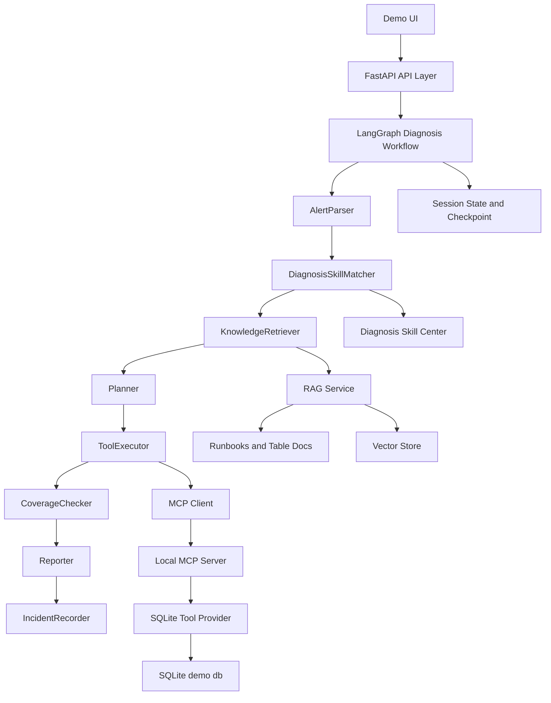

# 04 Technical Design - DataOps OnCall Agent

版本：v0.1
日期：2026-05-14
关联文档：01-product-requirements.md、02-user-stories.md、03-user-flow.md

## 1. 设计目标

DataOps OnCall Agent 是一个面向数据平台故障诊断的 Agent 应用项目。技术设计目标不是追求生产级大而全，而是用清晰、可演示、可解释的工程结构实现一个能支撑面试追问的 MVP。

本项目重点展示以下能力：

- 用 FastAPI 构建 Agent 应用后端。
- 用 LangGraph 编排多步骤诊断流程。
- 用 Diagnosis Skill 表达可配置的故障诊断策略。
- 用 RAG 检索 Runbook、表说明和历史事故资料。
- 用 MCP Tool 暴露数据平台查询能力。
- 用 SQLite 模拟数据平台元数据和故障场景。
- 用 CoverageChecker 防止工具没查全就过早下结论。
- 用结构化 Session State 解决多轮对话上下文丢失问题。

## 2. 核心设计原则

### 2.1 先收集证据，再生成结论

Agent 不能直接根据用户告警生成最终答案。正确流程是：先解析告警，再匹配 Diagnosis Skill，随后检索知识、调用工具、检查证据覆盖率，最后生成报告。

### 2.2 Diagnosis Skill 是策略，不是工具

Diagnosis Skill 不直接查询数据库，也不直接执行动作。它定义某一类故障的诊断策略，包括触发条件、必需工具、证据要求、风险等级和输出格式。

MCP Tool 才是具体动作，例如查询任务状态、表分区、数据量、字段空值率和血缘关系。

### 2.3 RAG 用于知识，MCP 用于证据

RAG 负责检索 Runbook、表说明、数据质量规则和历史事故复盘。MCP Tool 负责查询当前诊断所需的结构化事实数据。

### 2.4 长对话依赖结构化状态

多轮对话不能只依赖 LLM 上下文窗口。系统需要保存 `session_id`、`incident_id`、当前表、当前字段、已匹配 Skill、工具证据和最终报告。

### 2.5 模拟数据要可复现

MVP 使用 SQLite 和 seed 脚本生成模拟数据。这样面试演示、测试和 eval 都可以稳定复现，不依赖真实企业系统。

## 3. 系统架构

```text
Frontend Demo UI
  -> FastAPI API Layer
    -> LangGraph Diagnosis Workflow
      -> AlertParser
      -> DiagnosisSkillMatcher
      -> KnowledgeRetriever
      -> Planner
      -> ToolExecutor
      -> CoverageChecker
      -> Reporter
      -> IncidentRecorder
    -> Skill Center
    -> RAG Service
    -> MCP Client
      -> Local MCP Server
        -> SQLite Tool Provider
    -> SQLite Database
```

Mermaid 架构图：



## 4. 推荐技术栈

| 层 | 技术 | 说明 |
|----|------|------|
| API | FastAPI | 提供诊断、Skill、事故报告、聊天追问等接口 |
| Agent Workflow | LangGraph | 编排多节点诊断流程和状态流转 |
| LLM Adapter | OpenAI-compatible client | 可接 Qwen、OpenAI、DeepSeek 等兼容接口 |
| RAG | LangChain / LlamaIndex / 自实现轻量检索 | MVP 可先用轻量方案，后续替换向量库 |
| Vector Store | Chroma / FAISS / SQLite FTS | MVP 优先本地可运行，避免 Milvus 过重 |
| MCP | FastMCP / MCP Python SDK | 暴露工具给 Agent 调用 |
| DB | SQLite | 模拟数据平台元数据、诊断记录和工具日志 |
| Frontend | 简单 HTML/React/Streamlit | 以演示闭环为主，不做复杂产品化 |
| Test | pytest | 覆盖 Skill loader、工具层、工作流 smoke test |

说明：MVP 不建议一开始引入 Milvus、Kafka、Airflow、Spark、Flink 等重组件。真实组件可以在文档里说明替换方式，项目实现以稳定可演示为第一优先级。

## 5. 代码目录建议

```text
dataops-oncall-agent/
├── app/
│   ├── main.py
│   ├── config.py
│   ├── api/
│   │   ├── diagnose.py
│   │   ├── skills.py
│   │   ├── incidents.py
│   │   └── chat.py
│   ├── workflow/
│   │   ├── graph.py
│   │   ├── state.py
│   │   └── nodes/
│   │       ├── alert_parser.py
│   │       ├── diagnosis_skill_matcher.py
│   │       ├── knowledge_retriever.py
│   │       ├── planner.py
│   │       ├── tool_executor.py
│   │       ├── coverage_checker.py
│   │       ├── reporter.py
│   │       └── incident_recorder.py
│   ├── skills/
│   │   ├── loader.py
│   │   ├── matcher.py
│   │   ├── models.py
│   │   └── builtin/
│   │       ├── airflow_task_failed/
│   │       │   ├── skill.yaml
│   │       │   ├── runbook.md
│   │       │   └── examples.json
│   │       ├── partition_missing/
│   │       ├── data_volume_drop/
│   │       └── null_rate_spike/
│   ├── rag/
│   │   ├── indexer.py
│   │   ├── retriever.py
│   │   └── schemas.py
│   ├── mcp_client/
│   │   └── client.py
│   ├── tools/
│   │   ├── providers/
│   │   │   ├── base.py
│   │   │   └── sqlite_provider.py
│   │   └── schemas.py
│   ├── db/
│   │   ├── connection.py
│   │   ├── repositories.py
│   │   └── migrations/
│   └── models/
│       ├── api.py
│       ├── incidents.py
│       └── diagnosis.py
├── mcp_servers/
│   └── dataops_server.py
├── docs/
│   ├── runbooks/
│   ├── tables/
│   ├── postmortems/
│   └── quality_rules/
├── scripts/
│   ├── init_db.py
│   ├── seed_demo_data.py
│   ├── reset_demo_data.py
│   └── build_rag_index.py
├── eval/
│   ├── datasets/
│   └── run_eval.py
├── tests/
│   ├── test_skill_loader.py
│   ├── test_skill_matcher.py
│   ├── test_mcp_tools.py
│   ├── test_coverage_checker.py
│   └── test_workflow_smoke.py
├── static/
│   └── index.html
├── pyproject.toml
└── README.md
```

## 6. Diagnosis Skill 设计

### 6.1 职责

Diagnosis Skill 是运行时诊断策略配置，负责回答：

- 哪些告警描述会触发这个 Skill？
- 这个故障类型必须查哪些工具？
- 判断根因需要哪些证据？
- 报告需要包含哪些字段？
- 是否存在风险动作和人工确认？

### 6.2 skill.yaml 示例

```yaml
name: data_volume_drop
display_name: Data Volume Drop
version: 1
summary: Detect and diagnose abnormal table row count drops.
triggers:
  - 数据量下降
  - 行数变少
  - 环比下降
  - drop in row count
  - volume anomaly
symptoms:
  - data_volume_drop
required_tools:
  - query_data_volume
  - query_task_runs
  - query_table_partitions
  - query_lineage
evidence_requirements:
  - recent_row_count_trend
  - current_partition_status
  - related_task_status
  - downstream_impact
risk_level: medium
requires_confirmation: false
output_schema: incident_report
runbook: runbook.md
examples: examples.json
```

### 6.3 examples.json 示例

```json
[
  {
    "alert": "dws_sales_daily 今日数据量较昨日下降 92%，请判断是否存在数据事故。",
    "expected_skill": "data_volume_drop",
    "expected_entities": {
      "table_name": "dws_sales_daily",
      "symptom": "data_volume_drop"
    },
    "expected_tools": [
      "query_data_volume",
      "query_task_runs",
      "query_table_partitions",
      "query_lineage"
    ]
  }
]
```

### 6.4 Skill 加载规则

- 启动时扫描 `app/skills/builtin/*/skill.yaml`。
- 校验必填字段：`name`、`triggers`、`required_tools`、`evidence_requirements`。
- 加载 `runbook.md` 和 `examples.json`。
- 生成内存 registry，供 matcher 和 API 查询。

### 6.5 Skill 匹配策略

MVP 可以采用两段式：

1. 规则召回：基于关键词、symptoms、表述模式召回候选 Skill。
2. LLM rerank：让 LLM 在候选 Skill 中选择最合适的一个，并返回理由和置信度。

如果最高置信度低于阈值，例如 `0.65`，进入澄清流程。

## 7. LangGraph Workflow 设计

### 7.1 Workflow 节点

| 节点 | 输入 | 输出 | 职责 |
|------|------|------|------|
| AlertParser | raw_alert | alert_context | 解析表名、任务名、字段、时间、症状 |
| DiagnosisSkillMatcher | alert_context | selected_diagnosis_skill | 选择诊断策略 |
| KnowledgeRetriever | skill + context | retrieved_docs | RAG 检索 Runbook 和相关文档 |
| Planner | skill + docs + context | plan | 生成诊断步骤 |
| ToolExecutor | plan | tool_calls + evidence | 调用 MCP Tool 查询事实 |
| CoverageChecker | skill + tool_calls + evidence | coverage_result | 检查工具和证据覆盖率 |
| Reporter | state | final_report | 生成 Markdown 报告 |
| IncidentRecorder | final_report | incident_id | 保存事故记录 |

### 7.2 State 定义

```python
class DiagnosisState(TypedDict, total=False):
    session_id: str
    raw_alert: str
    alert_context: dict
    selected_diagnosis_skill: dict
    candidate_diagnosis_skills: list[dict]
    retrieved_docs: list[dict]
    plan: list[str]
    tool_calls: list[dict]
    evidence: dict
    coverage_result: dict
    final_report: str
    incident_id: str
    needs_clarification: bool
    clarification_question: str
    errors: list[dict]
```

### 7.3 条件分支

```text
AlertParser
  -> 如果关键信息缺失：needs_clarification
  -> 否则进入 DiagnosisSkillMatcher

DiagnosisSkillMatcher
  -> 如果低置信度：needs_clarification
  -> 否则进入 KnowledgeRetriever

CoverageChecker
  -> 如果缺少关键工具且可以补查：回到 ToolExecutor
  -> 如果工具失败或证据不足：进入 Reporter，但标记 confidence_limit
  -> 如果证据完整：进入 Reporter
```

### 7.4 为什么使用 LangGraph

本项目需要多个节点、条件分支、状态保存和补充工具调用。相比单次 Agent 调用，LangGraph 更适合表达：

- 多步骤诊断流程。
- 中间状态可观察。
- 低置信度澄清。
- 工具覆盖率检查。
- 多轮诊断上下文保存。

面试口径：

> 我没有把所有逻辑写进一个 Prompt，而是把诊断流程拆成多个可观测节点。这样可以定位是 Skill 路由错、RAG 召回错、工具调用失败，还是报告生成阶段过度推断。

## 8. RAG 设计

### 8.1 文档来源

```text
docs/
├── runbooks/
│   ├── airflow_task_failed.md
│   ├── partition_missing.md
│   ├── data_volume_drop.md
│   └── null_rate_spike.md
├── tables/
│   ├── dws_sales_daily.md
│   └── ads_user_profile.md
├── postmortems/
│   ├── payment_sync_failed_2026_05.md
│   └── upstream_partition_missing_2026_05.md
└── quality_rules/
    ├── null_rate_check.md
    └── volume_anomaly_check.md
```

### 8.2 文档 metadata

每个 chunk 需要保存：

- `source_file`
- `doc_type`
- `section_title`
- `skill_name`
- `table_name`
- `chunk_id`

### 8.3 检索策略

MVP 推荐：

- 先按 `skill_name`、`table_name` 做 metadata filter。
- 再做关键词或向量检索。
- 返回 top 3 到 top 5。
- Reporter 必须展示引用来源。

### 8.4 RAG 失败处理

如果召回结果不足：

- 不阻断工具诊断。
- 在报告中说明知识依据不足。
- 不允许写“根据 Runbook”这种无来源表述。

## 9. MCP Tool 设计

### 9.1 工具列表

| Tool | 参数 | 返回 | 用途 |
|------|------|------|------|
| query_task_runs | task_name/table_name/date | task run list | 查询任务运行状态 |
| query_table_partitions | table_name/date | partition status | 查询表分区是否产出 |
| query_data_volume | table_name/start_date/end_date | row count trend | 查询数据量趋势 |
| query_null_rate | table_name/field_name/start_date/end_date | null rate trend | 查询字段空值率 |
| query_lineage | table_name/direction/depth | upstream/downstream tables | 查询血缘影响 |
| create_incident_report | report payload | incident_id | 保存事故报告 |

### 9.2 Provider 抽象

MVP 底层实现是 SQLite，但工具层需要留出 provider 抽象。

```python
class DataOpsToolProvider(Protocol):
    def query_task_runs(...): ...
    def query_table_partitions(...): ...
    def query_data_volume(...): ...
    def query_null_rate(...): ...
    def query_lineage(...): ...
    def create_incident_report(...): ...
```

真实系统迁移时可以替换为：

- Airflow API。
- Hive Metastore。
- DataHub / OpenLineage。
- Great Expectations / Soda。
- Prometheus / 日志平台。
- 内部工单系统。

### 9.3 工具调用日志

每次 MCP Tool 调用都需要记录：

- 工具名。
- 参数。
- 状态。
- 返回摘要。
- 错误信息。
- 耗时。

这既服务于调试，也服务于最终报告的证据链。

## 10. CoverageChecker 设计

### 10.1 解决的问题

Agent 项目常见问题之一是工具调用不完整：模型可能查了一个工具就开始生成结论。本项目用 CoverageChecker 把 Diagnosis Skill 中的 `required_tools` 和 `evidence_requirements` 转成可检查约束。

### 10.2 输入

```json
{
  "skill": {
    "name": "data_volume_drop",
    "required_tools": ["query_data_volume", "query_task_runs", "query_table_partitions", "query_lineage"],
    "evidence_requirements": ["recent_row_count_trend", "current_partition_status", "related_task_status", "downstream_impact"]
  },
  "tool_calls": [...],
  "evidence": {...}
}
```

### 10.3 输出

```json
{
  "required_tools_coverage": 0.75,
  "missing_tools": ["query_lineage"],
  "evidence_coverage": 0.75,
  "missing_evidence": ["downstream_impact"],
  "can_generate_final_report": true,
  "confidence_limit": "medium"
}
```

### 10.4 决策规则

- 覆盖率 100%：生成完整报告。
- 缺少非关键证据：生成报告，但标记证据不足。
- 缺少关键证据且工具可用：补充调用工具。
- 工具失败：生成降级报告，说明无法确认的部分。

## 11. Session State 设计

### 11.1 保存内容

```json
{
  "session_id": "session-001",
  "incident_id": "incident-20260514-001",
  "current_table": "dws_sales_daily",
  "current_task": "dws_sales_daily_job",
  "current_field": null,
  "selected_diagnosis_skill": "data_volume_drop",
  "last_report_id": "report-001",
  "evidence_summary": {
    "row_count_drop": "92%",
    "downstream_tables": ["ads_sales_report"]
  }
}
```

### 11.2 用途

- 支持“它影响哪些下游报表？”这类追问。
- 支持继续补充工具调用。
- 支持在报告页面恢复诊断过程。
- 支持后续 eval 分析。

## 12. 错误处理和降级策略

| 问题 | 处理方式 |
|------|----------|
| 告警缺少表名 | 请求用户补充 |
| Skill 匹配低置信度 | 返回候选 Skill 并澄清 |
| RAG 无结果 | 继续工具诊断，报告说明知识依据不足 |
| MCP Tool 失败 | 记录错误，报告说明缺失证据 |
| 证据覆盖不足 | 限制结论置信度，不给确定根因 |
| LLM 不可用 | 工具层和测试仍可运行，报告生成降级为模板 |

## 13. 测试设计

### 13.1 单元测试

- Skill loader 能加载 4 个内置 Diagnosis Skill。
- Skill matcher 能正确匹配 20 条示例告警。
- SQLite provider 能返回预期数据。
- CoverageChecker 能识别缺失工具。
- RAG retriever 能召回对应 Runbook。

### 13.2 集成测试

- `data_volume_drop` 端到端 smoke test。
- `partition_missing` 端到端 smoke test。
- 工具失败时报告包含错误说明。
- 低置信度输入触发澄清。

### 13.3 Eval 指标

- Diagnosis Skill 匹配准确率。
- 必需工具覆盖率。
- RAG 引用命中率。
- 报告证据完整率。
- 端到端诊断成功率。

## 14. 部署设计

MVP 本地启动流程：

```text
1. 安装依赖
2. 初始化 SQLite schema
3. 写入 demo seed 数据
4. 构建 RAG index
5. 启动 MCP Server
6. 启动 FastAPI
7. 打开 Demo UI
```

推荐命令：

```bash
uv sync
uv run python scripts/reset_demo_data.py
uv run python scripts/seed_demo_data.py
uv run python scripts/build_rag_index.py
uv run python mcp_servers/dataops_server.py
uv run uvicorn app.main:app --reload --port 9900
```

后续可以补 Docker Compose，但 MVP 阶段优先保证本地可跑。

## 15. 面试可讲挑战

### 15.1 Skill 路由错误

解决方案：规则召回 + LLM rerank + 置信度阈值 + 澄清机制。

### 15.2 工具调用不完整

解决方案：Diagnosis Skill 定义 `required_tools`，CoverageChecker 检查覆盖率。

### 15.3 RAG 召回错误

解决方案：metadata filter、top-k、引用来源、eval case。

### 15.4 长对话丢失上下文

解决方案：结构化 Session State 保存当前 incident、表、字段和证据。

### 15.5 模拟数据不等于真实生产

解决方案：工具层 provider 抽象。MVP 使用 SQLite，真实环境替换为 Airflow API、Hive Metastore、DataHub 或数据质量平台。

## 16. 设计取舍

| 选择 | 原因 |
|------|------|
| SQLite 而不是真实 Airflow/Hive | 降低启动成本，保证演示可复现 |
| Chroma/FAISS 而不是 Milvus | MVP 更轻，避免部署复杂度抢走重点 |
| Diagnosis Skill 而不是一个大 Prompt | 可解释、可扩展、能做工具覆盖检查 |
| LangGraph 而不是单次 agent.invoke | 需要节点可观测、条件分支和状态流转 |
| 先做 4 个场景 | 聚焦深度，避免功能堆砌 |

## 17. 技术设计总结

本项目的技术核心不是“会调用大模型”，而是把 DataOps 故障诊断拆成可观测、可约束、可评估的 Agent 工作流。

最重要的架构表达：

```text
Diagnosis Skill 决定诊断策略和证据要求；
RAG 提供 Runbook 和历史经验；
MCP Tool 查询当前事实证据；
LangGraph 编排诊断状态；
CoverageChecker 防止工具没查全就下结论；
Session State 支持多轮追问和事故上下文延续。
```


